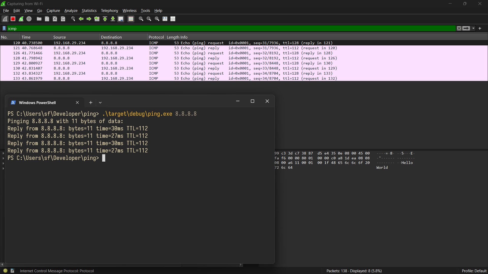

Ping
====

I was reading this article by Amos titled ["Make your own Ping"][1], and I
didn't just wanted to read and forget about it, I wanted to follow along (as the
examples were in Rust) and so this repository contains just that, me following
along the article and making "my own" ping.

Here is the screenshot of ICMP packets being sent and getting proper responses.

The `ping` crate in this workspace previously used the functionality provided by
the windows to send ping requests and response, now it uses the `ersatz` crate for
the same purpose. The `IcmpSendEcho` function provided by windows kernel can
still be used in the ping crate, it is can be found in `ping/src/icmp/icmp_sys.rs`

The `ersatz` crate uses the `rawsock` crate which utilizes npacp library on
windows to provide a network interface in the user space, the rawsock crate
buffers the packets and that is why we see packets taking a second to get back
to us.

[1]: https://fasterthanli.me/series/making-our-own-ping
